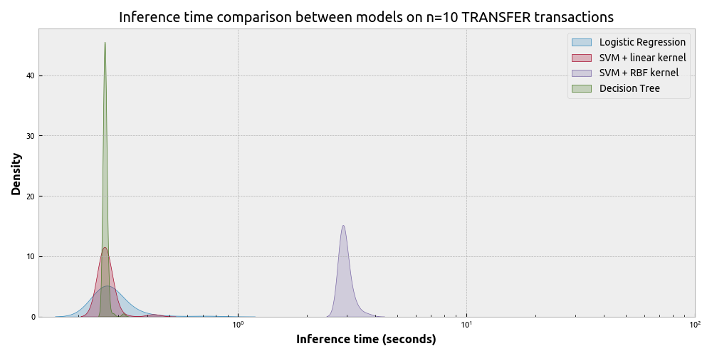
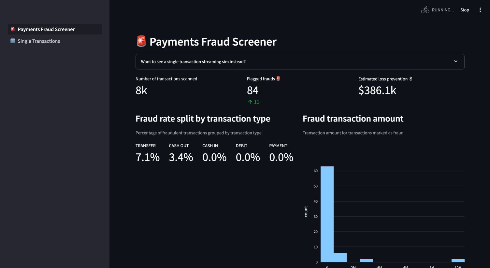
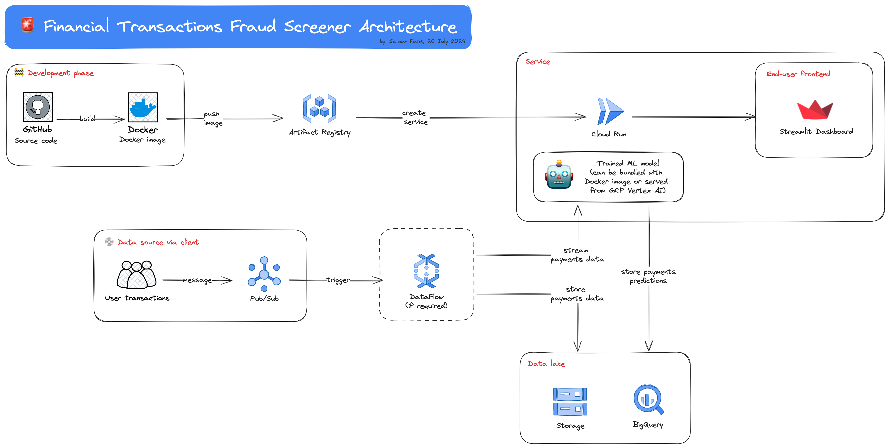

# 💷 Financial Transactions Fraud Detection 🚨

#### Table of Contents

- [Project structure](#project-structure)
- [1. Experimentation](#1-experimentation)
  - [1.1. Fraud detection strategy research – paper reproduction](#11-fraud-detection-strategy-research--paper-reproduction)
  - [1.2. From research to a production model](#12-from-research-to-a-production-model)
    - [Discussion](#discussion)
- [2. Deployment](#2-deployment)
- [What was not covered](#what-was-not-covered)

## Project structure

This project consists of two key sections:

1. Experimentation
2. Deployment

## 1. Experimentation

### 1.1. Fraud detection strategy research – paper reproduction

In the experimentation phase, my first focus is to reproduce and verify the class weight strategy by Aditya Oza in his preprint ["Fraud Detection using Machine Learning" (Oza, 2018)](https://www.semanticscholar.org/paper/Fraud-Detection-using-Machine-Learning-Oza-aditya/9f2c08d9efaa53cfabdd0ec47afa8015c7ff5bb9).

I wrote a full report on this strategy validation which can be found here: [Replication & extension of "_Fraud Detection using Machine Learning_" (Oza, 2018)](https://storage.cloud.google.com/financial-fraud-experiment-docs/replication_oza_2018_report.html).

The top level findings include:

- The class weight strategy does work ✅ – one can attain a model that minimizes false positive rate such that recall is reasonably controlled.
- We did get precision and recall curve with shapes similar to that of the paper. ✅
- However, we did NOT get the exact same ideal class weights as the author. ❌ 
  - I suspect that this is strongly related to the choice of random seed. The random seed dictates the training samples seen by the algorithm; considering the super low rate of fraudulent transactions, the probability distribution of the covariates can change dramatically with different training samples.
  - Furthermore, the ideal class weight obtained in the paper is done only via a single run (which can already take several hours; actually days for SVM with RBF kernel). I would argue we need to perform multiple runs and consider the uncertainty bands around this ideal class weight for experiment reporting.
- We obtained and and can draw the same conclusion from the precision-recall curves when comparing between models; with logistic regression being a superior lightweight choice and with SVM + RBF kernel only overperforming by a small margin. ✅
- We introduce a new experiment to measure the inference time on out-of-sample data. We found that while the SVM + RBF kernel performs relatively well, the inference time introduces a huge latency especially for production usage.

Considering the performance-latency tradeoff, we opted for the more lightweight logistic regression model to be used for deployment.

### 1.2. From research to a production model

Oza's experiment did a granular analysis by training a model for each transaction type where there exists a fraudulent transaction. To recap, there are five transaction types:

1. `CASH_IN`: A cash deposit transaction via a merchant.
2. `CASH_OUT`: A cash withdrawal transaction via  merchant.
3. `DEBIT`: Similar to `CASH_OUT`. A cash withdrawal transaction from the mobile money service into a bank account.
4. `PAYMENT`: A payment transaction. Increases the balance of receiver and decreases the balance of the payee.
5. `TRANSFER`: Cash transfers between accounts using the mobile money platform.

In the dataset, fraudulent transactions only occured through `CASH_OUT` and `TRANSFER` transactions which means that two separate models, for each model type – logistic regression, linear SVM and SVM+RBF kernel, were trained in Oza's analysis and our replication. But we did not train a model for the other types – `CASH_IN`, `DEBIT`, `PAYMENT`.

Our experimentation phase gave us the best ML model for each transaction type. To extend our experiment results to a single production model, we can introduce a rule-based system where given a transaction data $D$, if the transaction type is not in `TRANSFER` or `CASH_OUT`, then we automatically label it as non-fraudulent; otherwise, we run $D$ into one of our trained models depending on the transaction type. Our inference pipeline thus looks as follows:

#### Discussion

The inference pipeline is designed to only flag potential fraudulent transactions based on historical fraud:

- For transaction types where there are historical fraud activities, we trained models that attain less than a 1% false positive rate (for positive user experience) while maximizing recall (to minimize loss due to fraud).
- For transaction types where there is no fraud history, however, the rule-based nature dictates flagging the transaction as not fraudulent... which is not ideal and is a key vulnerability.
So how do we address this?

Well, you can train a single machine learning model that can use transaction type as a feature. This can be both computationally and monetarily expensive as you are adding $n$ new features where $n$ is the total number of transaction types. We actually did this, and training time was not the issue; rather, the model just did not perform as well. We saw a huge 20-30% drop in recall, which implies that we are accepting more losses due to fraudulent transactions!

Alternatively, we can train a separate ML model that ignores transaction type and tries to flag fraudulent activities simply from the other features like the amount of the transaction and the balance in the SOURCE and DESTINATION accounts, before and after the transaction. This model should run in tandem with the specialized trained models and be used for types that are not known to have historical fraud. In this case, you can still enjoy the good recall values from the specialized transaction type models. However, the drawback is that you now have to design, develop, and maintain an additional model. This means added latency and monetary cost when putting the final pipeline into production.

BUT note that maintaining a better recall means that we save monetary costs that we would otherwise have to pay due to not flagging fraud properly. So it really depends on your business case and how you want to optimize the solution.

## 2. Deployment

Now that we got a trained model, let's put this model into a working production environment.

The idea is that I will be simulating streaming financial transactions using the entire PaySim dataset and use the trained machine learning model to flag incoming transactions as fraud or not.

To visualize this process, I built a web app using Streamlit. The app is Dockerize with a Dockerfile and the image is pushed to the Google Artifact Registry. We then grabbed the pushed Docker image and deploy it using Google Cloud Platform (GCP) Cloud Run.

### Deployed web app

The deployed web app can be found here (please use Google Chrome!): https://fraud-web-app-qmjqqzknzq-ew.a.run.app/.

Open the app in Google Chrome v126.0 and above for best experience. For some reason, the app does not work in Safari ~16.0. I have not tested other browsers.

### App service architecture

The envisioned architecture for the service:

## What was not covered

Data onboarding was unfortunately not covered. I love data onboarding but unfortunately conjuring my own financial transactions dataset seems meaningless as that would introduce some kind of inherent bias.

## Development

### TODOs – experimentation
- [X] Reproduce Oza's analysis results
  - [X] `TRANSFER` with Logistic regression 
  - [X] `TRANSFER` with Linear SVM
  - [X] `TRANSFER` with SVM + RBF kernel
  - [X] `CASH_OUT` with Logistic regression 
  - [X] `CASH_OUT` with Linear SVM
  - [X] `CASH_OUT` with SVM + RBF kernel
- [X] Experiment with universal model using transaction type as a feature.
- [X] New experiment to compare inference time between models to justify model choice for deployment.
- [X] Write full report on replication results versus Oza's analysis
- [ ] Add MLflow / Aim / W&B logging

### TODOs – deployment
- [X] Build a simple Streamlit app that works locally
- [X] Devise an ML inference pipeline that ingests data and spits out prediction
- [X] Dockerize Streamlit app
- [X] Push Docker image to Google Artifact Registry
- [X] Deploy image to GCP Cloud Run
- [ ] Build Pub/Sub mock data trigger
  - In practice it is triggered via an independent Cloud Function, but my idea is to do a mock call by triggering a Pub/Sub call via the Streamlit web app which then passes it to the Streamlit app itself that is actively listening for the Pub/Sub message.
- [ ] Build mock BigQuery data warehouse 
  - We don't really need the advantage of BigQuery tables since this is a self-contained app, so we can use something like local SQLite database if we really want to use tables. Or just keep using the CSVs. Obviously in a real-world environment we want to put the data in a data warehouse so that lineage can be guarded and it can be easily accessed by other users and services.

### TODOs – documentation
- [X] Draw architecture diagram for GCP deployment
- [X] Draw diagram for inference pipeline
- [X] Write README
- [X] Add Streamlit landing page as static image to README
- [X] Add Streamlit landing page as GIF to README
- [ ] Do a blog writeup?